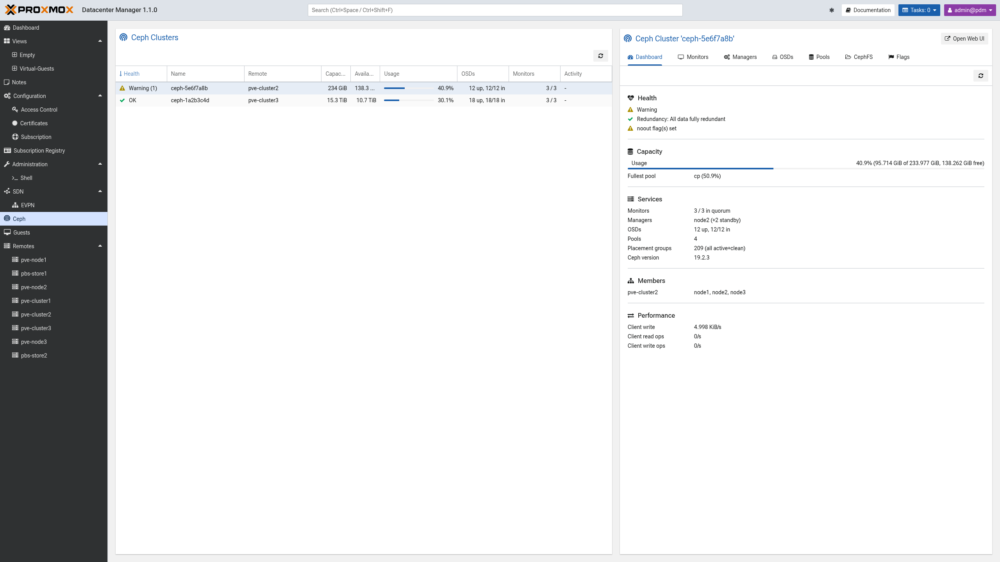
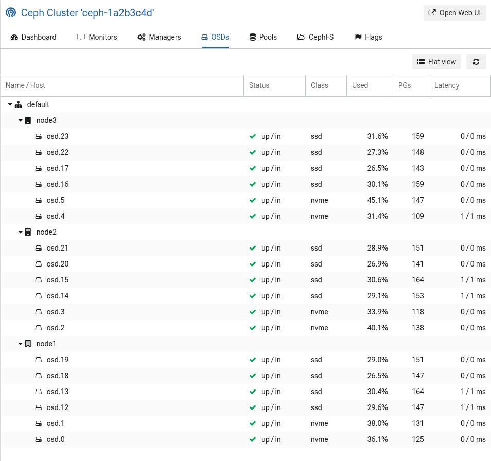

.. _ceph:

Ceph
====

Proxmox Datacenter Manager can monitor the Ceph clusters of connected
hyper-converged Proxmox VE remotes. The "Ceph" entry in the sidebar collects
the Ceph clusters across all configured remotes, so the health, capacity, and
service state of several clusters can be reviewed from a single place.

The Ceph integration is read-only: it surfaces the state of a cluster for
monitoring and triage but does not create, change, or destroy Ceph resources.
Use the "Open Web UI" button (see below) to jump to the cluster's own Proxmox VE
interface for any management operation.

Cluster Overview
----------------

The overview lists each detected Ceph cluster as one row with the following
columns:

* **Health**: the overall Ceph health status, with the number of active health
  checks in parentheses. The cell is colored so that a warning or error stands
  out.
* **Name** and **Remote**: the cluster name and the Proxmox VE remote that backs
  it.
* **Capacity** and **Available**: the raw total and free capacity of the
  cluster.
* **Usage**: a threshold-colored meter with the used percentage.
* **OSDs**: the object storage daemon counts, phrased as ``{up} up,
  {in}/{total} in`` so the running count, which is the availability concern, and
  the in-cluster fraction, which is the data-placement concern, stay readable in
  one cell.
* **Monitors**: the monitor quorum, phrased as ``{in quorum} / {total} in
  quorum``.
* **Activity**: a short status such as "Near full", "Degraded", or "Recovering"
  when the cluster is not in a clean state.

Select a cluster to open its detail panel.

Cluster Detail
--------------

The detail panel presents one cluster across several tabs.

Dashboard
^^^^^^^^^

The Dashboard tab is the at-a-glance summary of the cluster:

* **Health**: the health status together with a plain-language assessment of
  whether data is at risk, the recovery progress when a recovery is in flight,
  and the list of active Ceph health checks.
* **Capacity**: the cluster-wide usage meter.
* **Services**: the count of monitors in quorum, managers, OSDs, pools, and
  placement groups, plus the running Ceph version. A mixed-version cluster is
  marked as such.
* **Members**: the Proxmox VE remotes, and their nodes, that back this cluster.
* **Performance**: client and recovery throughput, shown while there is activity.

Monitors, Managers, OSDs, Pools, CephFS, and Flags
^^^^^^^^^^^^^^^^^^^^^^^^^^^^^^^^^^^^^^^^^^^^^^^^^^^^

The remaining tabs each list one class of Ceph component:

* **Monitors**: the monitors with their host, quorum status, address, and
  version.
* **Managers**: the Ceph managers and the metadata servers, each with host,
  state, address, and version.
* **OSDs**: the OSDs, either as a host or OSD tree or as a flat list, with their
  up and in status, device class, usage, placement-group count, and latency.
* **Pools**: the pools with their type, size and minimum size, placement-group
  count, usage, autoscale mode, CRUSH rule, and assigned application.
* **CephFS**: the Ceph file systems with their data and metadata pools.
* **Flags**: the cluster-wide OSD flags that are currently set.

Open Web UI
-----------

The "Open Web UI" button in the cluster detail header opens the backing Proxmox
VE node's native Ceph panel in a new tab, on the subview that matches the
currently selected tab. Use it to perform any management operation that the
read-only Proxmox Datacenter Manager view does not offer.

Permissions
-----------

Viewing a cluster requires the ``Resource.Audit`` privilege on the backing
remote. Clusters whose remote the user may not audit are omitted from the
overview.
