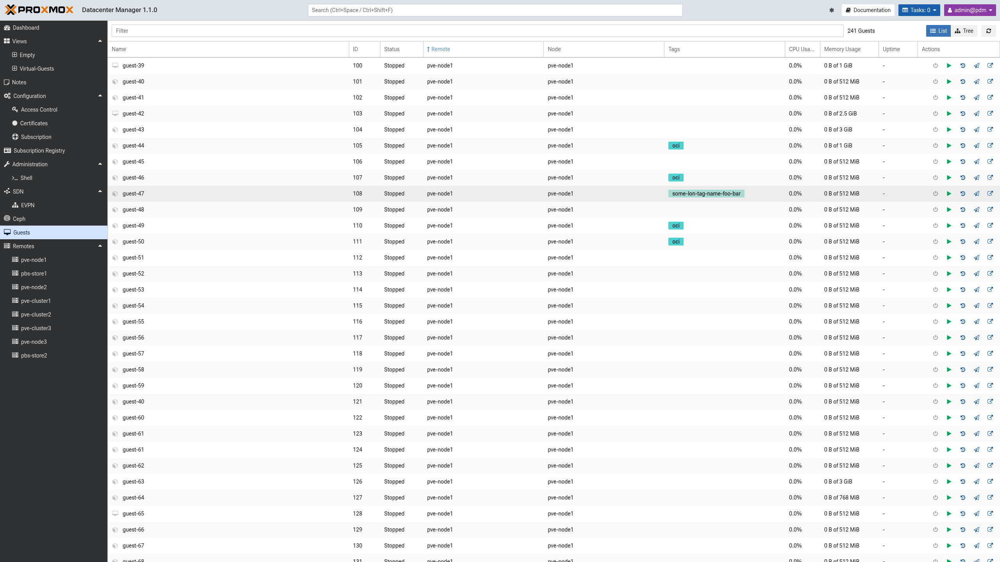
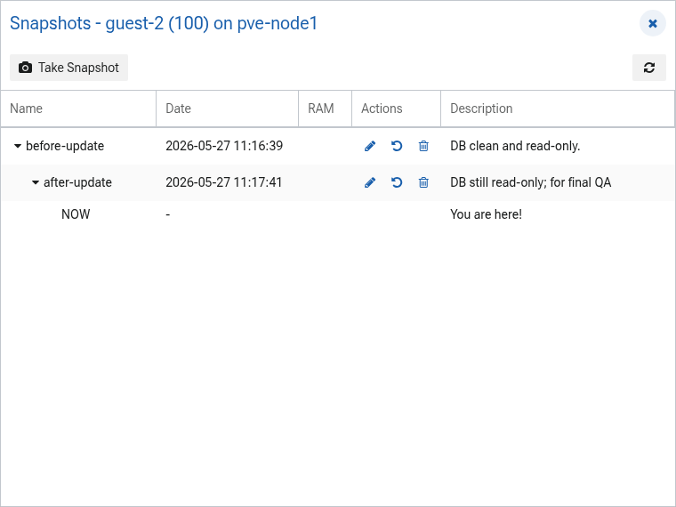

.. _guests:

Guests
======

The "Guests" entry in the sidebar provides a single, cross-remote view of every
QEMU virtual machine and LXC container that Proxmox Datacenter Manager knows
about. It collects the guests of all configured Proxmox VE remotes into one
list, so the whole fleet can be searched, sorted, and acted on without first
navigating to the owning remote.

It covers the most common day-to-day tasks, including the per-guest power
actions and snapshot management.

List and Tree View
------------------

A toggle in the toolbar switches between two presentations of the same data:

* **List**: a flat, sortable table of all guests. This is the default. It shows
  the guest name, ID, status, remote, node, tags, CPU usage, memory usage,
  uptime, and a column of per-guest actions. Click a column header to sort by
  it, including by CPU or memory usage.
* **Tree**: the guests grouped by remote, each remote a collapsible parent with
  its guest count. The columns are the same except that the remote is implied by
  the group, so it is not repeated per row.

Filtering
---------

The "Filter" box narrows the list as you type. A bare word matches as a
substring against every visible column, such as the name, ID, status, type,
node, remote, or tags.

A term can also be qualified with a ``field:value`` prefix to restrict it to a
single column. The supported qualifiers are:

* ``tag:`` -- a guest tag
* ``remote:`` -- the remote name
* ``node:`` -- the node name
* ``status:`` -- the run status, such as ``running`` or ``stopped``
* ``type:`` -- the guest type, ``qemu`` or ``lxc``

Multiple terms are combined with a logical AND and separated by spaces, so
``tag:prod status:running`` matches only running guests that carry the ``prod``
tag. Matching is case-insensitive. This is the same qualifier syntax as the
global search field in the header.

Guest Actions
-------------

The actions column offers the common life-cycle operations for each guest,
enabled according to its current state:

* **Start**: power on a stopped guest.
* **Resume**: resume a paused or suspended QEMU virtual machine, complementing
  the start, shutdown, and stop actions. Offered only for QEMU guests in a
  paused, suspended, or prelaunch state.
* **Shutdown**: gracefully shut down a running guest.
* **Snapshots**: open the snapshot management dialog for the guest (see below).
* **Migrate**: migrate the guest to another node, within the same remote
  (cluster) or across remotes. Not offered for templates.
* **Open in PVE UI**: open the guest in the backing Proxmox VE web interface in
  a new tab.

Snapshots
---------

Snapshot management is available for both QEMU and LXC guests, either from the
"Snapshots" action in the guest list or from the "Snapshots" tab in a guest's
detail panel.

The dialog lists a guest's snapshots as a parent/child tree that reflects how
each snapshot was taken from the one before it. The current running state is
shown as a ``NOW`` entry at the appropriate place in the tree. For each snapshot
the dialog shows the name, the time it was taken, whether it includes the guest
RAM (for QEMU guests), and its description.

The following operations are available:

* **Take Snapshot**: create a new snapshot of the current state. For QEMU guests
  the memory can optionally be included.
* **Edit Description**: change the description of an existing snapshot.
* **Rollback**: revert the guest to the selected snapshot.
* **Delete**: remove the selected snapshot.

Permissions
-----------

The guest list shows the resources the user may audit, and every action is
carried out against the backing remote, where the remote's own privileges
apply. An operator therefore needs the appropriate permission on the target
guest's remote for an action to succeed.
