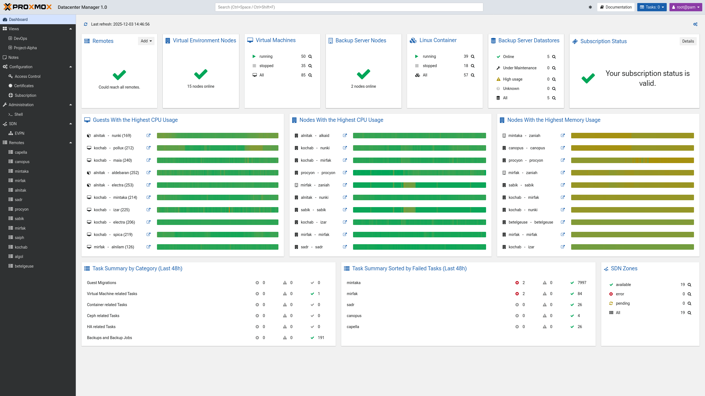

Introduction
============

What is Proxmox Datacenter Manager?
-----------------------------------

Proxmox Datacenter Manager is a centralized management platform designed to oversee Proxmox Virtual
Environment and Proxmox Backup Server instances across disjointed locations.
It provides a unified view of all registered resources, including nodes, virtual machines,
containers, storages, and backup datastores, regardless of their geographic location.

This solution supports managing both single-node installations and complex clusters. In the context
of Proxmox Datacenter Manager, these connected instances are referred to as **remotes**.

The platform allows for active resource control, enabling administrators to execute power
operations, apply system updates, and perform live migrations across the infrastructure. It acts as
a high-level control plane while providing a seamless transition ("escape hatch") to the native web
interfaces of individual remotes for granular configuration. This architecture ensures a loosely
coupled system where the central manager does not become a bottleneck or a single point of failure
for the operation of the underlying remotes.

Feature Overview
----------------

Proxmox Datacenter Manager provides the following core capabilities:

* **Centralized Inventory**: Connect and manage a scalable number of independent nodes and clusters
  ("Datacenters") from a single interface.
* **Unified Resource Monitoring**: View the status, health, and load of global resources, including
  nodes, virtual guests, and storage backends.
* **Global Dashboard**: A high-level dashboard visualizes the state of all remotes, highlighting
  potential issues such as high resource consumption (CPU & memory) or failed tasks.
* **Task Aggregation**: Centralized access to task logs across the entire infrastructure for
  auditing and troubleshooting.
* **Lifecycle Management**: Perform basic power operations (start, stop, reboot, shutdown) on nodes
  and virtual guests directly from the central view.
* **Update Management**: Monitor available updates and security patches across the server fleet.
* **Cross-Cluster Migration**: Execute live migrations of virtual guests between nodes, supporting
  transfers within the same remote (cluster) or across different remotes.
* **Advanced Access Control**: Supports enterprise authentication standards, including LDAP/Active
  Directory and OpenID Connect (SSO), integrated with a granular permission system.
* **Certificate Management**: Integrated ACME support (e.g., Let's Encrypt) for automated
  certificate management.

Technology Stack
----------------

Proxmox Datacenter Manager relies on a modern, secure, and performant technology stack:

* **Core Language**: The project is primarily developed in the **Rust** programming Language,
  ensuring memory safety and high performance.
* **Backend Architecture**:

 * The backend exposes a JSON-based REST API.
 * It utilizes a dual-daemon architecture standard for Proxmox projects:

   1. **Main API Daemon**: Runs as an unprivileged user to handle external requests, minimizing the
      attack surface.
   2. **Privileged Daemon**: Runs as root and listens exclusively on a local UNIX socket to execute
      system-level operations.

 * The backend leverages the existing, battle-tested REST/API stack from Proxmox Backup Server.
 * Communication occurs over TCP port 443 (HTTPS).

* **Frontend Architecture**:

  * The web interface is a Single Page Application (SPA) written in **Rust** using the **Yew**
    framework.
  * It is compiled to **WebAssembly (Wasm)**, offering high performance and type safety similar to
    the backend.
  * The UI components are built upon the `proxmox-yew-widget-toolkit`, enabling a consistent look
    and feel across the Proxmox ecosystem.

.. _get_help:

Getting Help
------------

.. _get_help_enterprise_support:

Enterprise Support
^^^^^^^^^^^^^^^^^^

Customers with an active Basic, Standard, or Premium subscription for
their Proxmox remotes gain access to the Proxmox Datacenter Manager Enterprise
Repository and technical support.

For more information, please visit https://www.proxmox.com or contact <mailto:sales@proxmox.com>.

Community Support Forum
^^^^^^^^^^^^^^^^^^^^^^^

The `Proxmox Community Forum`_ is a primary resource for user discussions and knowledge sharing.
Moderated by the Proxmox support team, it connects a global user base and serves as an extensive
database of solutions and configurations.

Mailing Lists
^^^^^^^^^^^^^

Proxmox Datacenter Manager is open-source software. The development mailing list is the primary
communication channel for contributing developers:

:Mailing list for developers: `PDM Development List`_

Bug Tracker
^^^^^^^^^^^

Proxmox maintains a public issue tracker at `<https://bugzilla.proxmox.com>`_. This system tracks
bug reports and feature requests. Users can subscribe to issues to receive notifications regarding
the status and resolution of submitted issues.

License
-------

|pdm-copyright|

This software is written by Proxmox Server Solutions GmbH <support@proxmox.com>.

Proxmox Datacenter Manager is free and open-source software: you can use it, redistribute it, and/or
modify it under the terms of the **GNU Affero General Public License** as published by the Free
Software Foundation, either version 3 of the License, or (at your option) any later version.

This program is distributed in the hope that it will be useful, but **WITHOUT ANY WARRANTY**;
without even the implied warranty of **MERCHANTABILITY** or **FITNESS FOR A PARTICULAR PURPOSE**.
See the GNU Affero General Public License for more details.

You should have received a copy of the GNU Affero General Public License along with this program.
If not, see AGPL3_.
