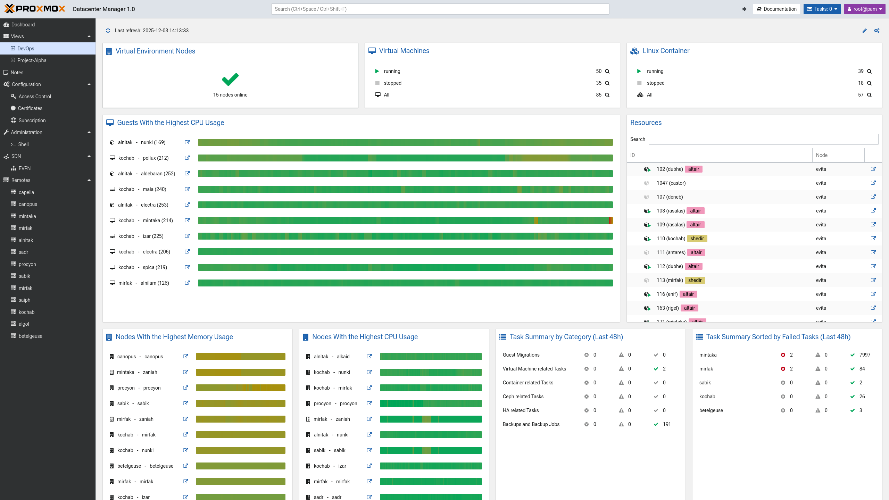
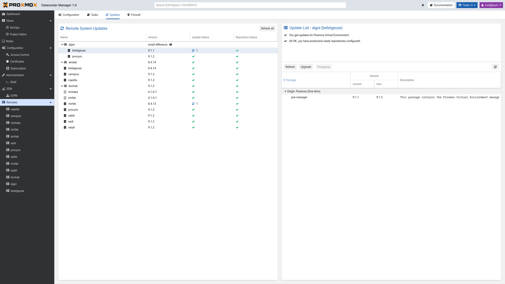
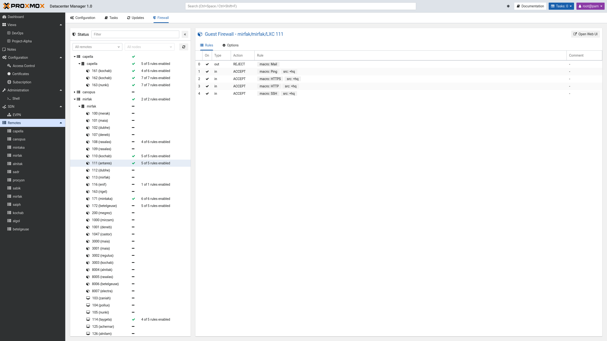
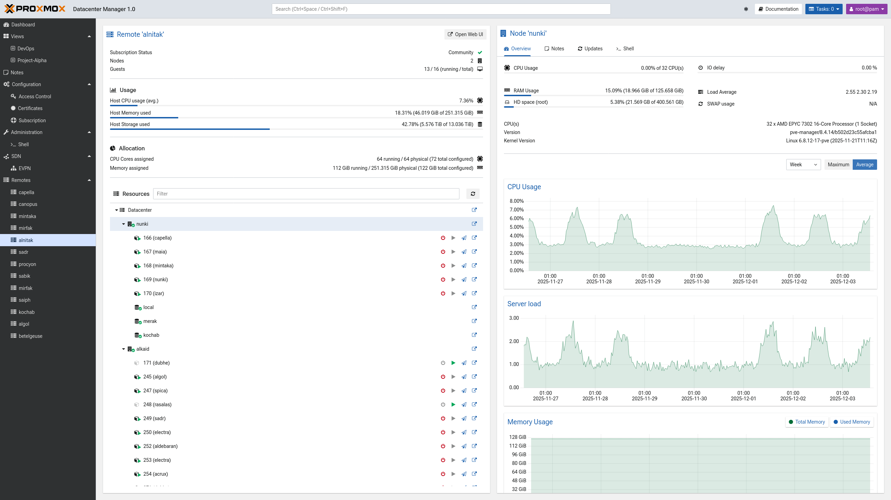
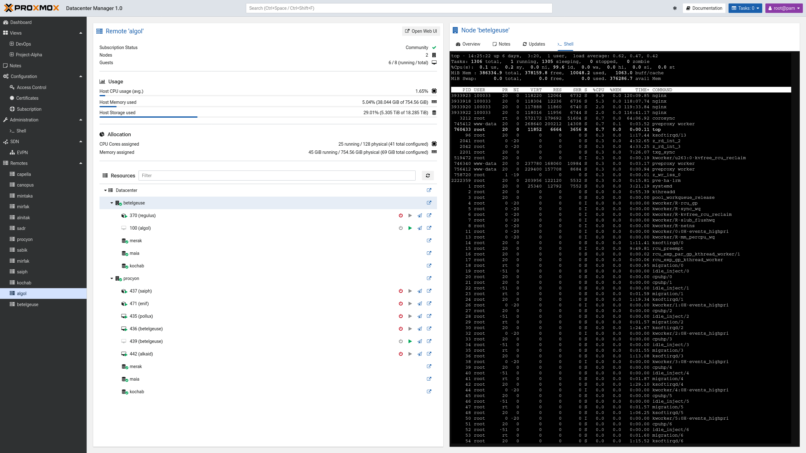

Graphical User Interface
========================

Proxmox Datacenter Management offers an integrated, web-based interface to manage the server.
This means that you can carry out all administration tasks through your web browser, and that you
don't have to worry about installing extra management tools. The web interface also provides a
built-in console, so if you prefer the command line or need some extra control, you have this
option.

The web interface can be accessed via https://youripaddress:8443.
The default login is `root`, and the password is either the one specified during the installation
process or the password of the root user, in case of installation on top of Debian.

.. note:: Most of the descriptions below will focus on the user interface set to "English", which
   uses the left-to-right text direction. If you use a language with a text direction from
   right-to-left, then some elements will appear on the right when the description says "left" and
   vice versa.

Features
--------

* Modern management interface for Proxmox Datacenter Manager
* Customizable Views.
* Management of remotes, resources, users, permissions, etc.
* Secure HTML5 console
* Support for multiple authentication sources
* Support for multiple languages
* Based on Yew, a modern Rust framework for creating multi-threaded, front-end web apps with
  WebAssembly.

Login
-----

..
  .. image:: images/screenshots/pdm-gui-login-window.png
  :target: _images/pdm-gui-login-window.png
  :align: right
  :alt: Proxmox Datacenter Manager login window

When you connect to the web interface, you will first see the login window.  Proxmox Datacenter
Manager supports various languages and authentication back ends (*Realms*), both of which can be
selected here.

.. note:: For convenience, you can save the username on the client side, by selecting the "Save User
   name" checkbox at the bottom of the window.

User Interface Overview
-----------------------

The Proxmox Datacenter Manager graphical interface can be roughly split into three different section:

* **Header**: On the left the header shows the current version information. In the middle a search
  bar is found that helps you find different remotes and resources. While on the right you can
  toggle the dark mode of the theme, go to the user documentation, open a list of tasks and open a
  menu to configure the theme and language that is used as well as log out.
* **Sidebar**: Below the header on the left the sidebar contains the main menu with the different
  menu options listed.
* **Main Panel**: The biggest part of the interface is taken up by the main panel. Its content will
  change depending on the menu selected in the sidebar. To start, the dashboard will be shown.

Sidebar
-------

In the sidebar, on the left side of the page, you can see various items relating
to specific management activities.

Dashboard
^^^^^^^^^

.. image:: images/screenshots/global-overview-dashboard.png
  :target: _images/global-overview-dashboard.png
  :align: right
  :alt: Proxmox Datacenter Manager Dashboard

The dashboard gives an overview of all configured remotes and resources. Including whether remotes
and their resources are up and running. Allowing you to tell at a glimpse how many VMs and CTs are
running or stopped across your data center and the state of all configured datastores. Information
on running tasks, CPU and memory usage, software defined networking (SDN) zones and the subscription
status is shown as well.

Views
^^^^^

:ref:`views` essentially allow you to create a custom dashboard. You can create a new view by copying an
existing view or creating it as an empty view. Then a set of filters can be applied to a view, so it
will only include information on specific resources or remotes. After creating a new view, select it
from the sidebar to see what it looks like. From there you can also adjust its layout and widgets.

Notes
^^^^^

In the notes section you can keep track of information that might be useful to other administrators
or yourself in the future. To format the notes, :ref:`Markdown <markdown-primer>` can be used. Notes
are shared across all data center users that have been granted access to them.

Configuration
^^^^^^^^^^^^^

To configure your Proxmox Datacenter Manager, navigate to the "Configuration" menu. It allows you to
change the time and timezone, the DNS server and the its network interfaces. A second tab makes the
WebAuthn Two Factor Authentication (TFA) settings available. There are also several sub-menus:

* **Access Control**: Manage users, API tokens, TFA settings, token and user permissions as well as
  authentication realms.
* **Certificates**: Set up custom TLS or automated ACME certificates.
* **Subscription**: To get proper support and access to the enterprise repository for your Proxmox
  Datacenter Manager, you can use this menu to check the subscription status.

Administration
^^^^^^^^^^^^^^

The administration menu can be used to get an overview of the Proxmox Datacenter Manager node
itself. Through the sub-menu "Shell" you can access the host's shell. Several tabs allow you to
manage different aspects of the node, such as:

* **Node Status**: See the CPU utilization, memory usage and other metrics of the Proxmox Datacenter
  Manager. Here you can also access package versions and the system report of your host, as well as
  reboot or turn of the host.
* **Updates**: Manage and install updates.
* **Repositories**: Add, enable and inspect update repositories.
* **Syslog**: Access the hosts system log.
* **Tasks**: An overview of all tasks of the host.

SDN
^^^

This menu provides an overview of all SDN zones across all configured Proxmox VE remotes. The EVPN
menu can be used to set up EVPN zones across multiple remotes via a single interface. More detailed
information on how to use Proxmox Datacenter Manager's SDN integration can be found in the
:ref:`sdn-integration` section.

Remotes
^^^^^^^

Remotes allows you to configure new remotes as well as manage existing one. The "Remotes" menu
itself provides different tabs to provide a unified view of your entire data center:

* **Configuration**: Shows a list of configured remotes and some basic information on them. It also
  allows configuring new remotes.
* **Tasks**: An overview of all tasks across the entire data center that can be filtered.
* **Updates**: Allows managing updates and package versions for all remotes.
* **Firewall**: Shows a list of configured firewall rules and settings for each Proxmox VE remote
  cluster, its nodes, and guests.

All configured remotes are also listed here in the sidebar. Each menu entry provides a split panel
that contains the most important information for each remote in an easy to navigate interface.

For Proxmox VE remotes this includes an overview of all nodes and guests in a cluster. By selecting
a guest or a node in the tree on the right, you can access its more detailed tabs on the left. For
nodes you can get an overview of their metrics, a read-only view of their notes and updates as well
as access to a "Shell" tab. This last tabs gives you access to the nodes shell, making management
easy.

Proxmox Backup Server remotes show an overview of all their datastores on the left. If you select
the node itself, you can see an overview of its most important metrics and a separate tab that shows
available updates. When selecting a datastore its usage and disk I/O are shown first. A second tab
provides a detailed view of its content by namespace.
